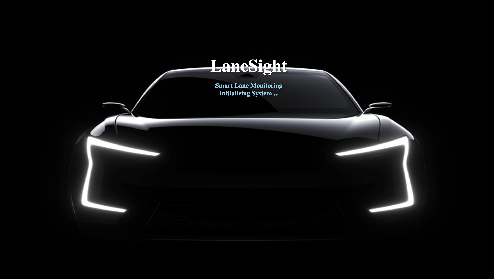
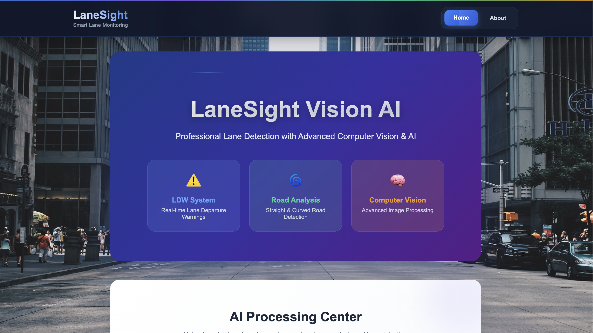
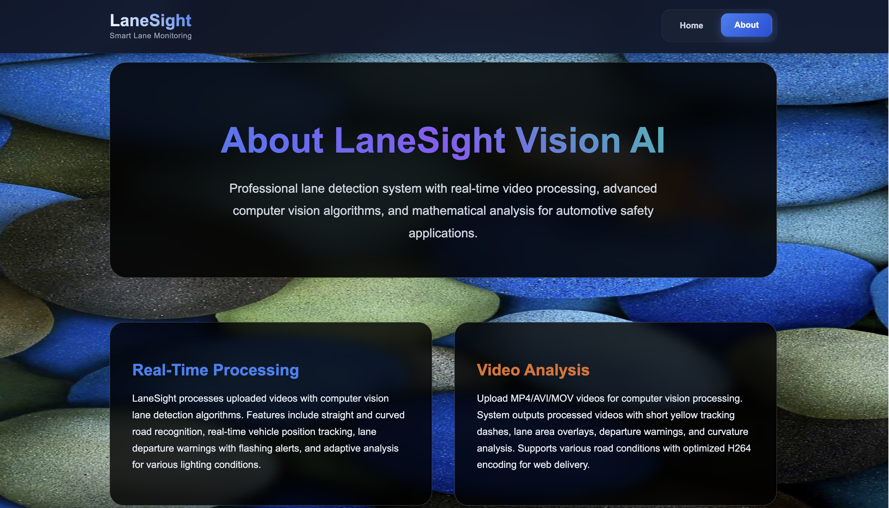

<h1 align="center">🚗 LaneSight Vision AI — Professional Lane Detection System</h1>

<p align="center">
  🚀 An advanced computer vision platform that combines React frontend with Python backend for professional lane detection, vehicle tracking, and automotive safety assistance with <b>real-time curvature analysis</b> and intelligent departure warnings.
</p>

<p align="center">
  
  
  
  
  
  
</p>
<br>

---

## 📖 Problem Statement
Automotive safety systems require precise lane detection for autonomous vehicles and driver assistance. Traditional methods struggle with varying lighting conditions, curved roads, and real-time processing demands, leading to inaccurate lane tracking and delayed warnings.

<br>

---

## 💡 Our Solution
LaneSight Vision AI is a comprehensive lane detection platform built to:

- 🛣️ Detect lane boundaries with 95% accuracy using advanced computer vision
- 🚗 Track vehicle position with real-time curvature analysis
- ⚠️ Provide instant lane departure warnings with visual alerts
- 🌙 Process videos in all lighting conditions (day/night/rain)
- 📊 Display professional metrics with confidence scoring
<br>

---  

## 🚀 Features

✅  **RANSAC Polynomial Fitting** with outlier rejection for precise lane detection  
✅  **Multi-color Space Analysis** using HLS, HSV, and LAB color spaces  
✅  **Adaptive Preprocessing** with CLAHE contrast enhancement  
✅  **Real-time Curvature Calculation** with radius measurement  
✅  **Lane Departure Warnings** with flashing visual alerts  
✅  **Professional UI** with confidence metrics and processing status  
✅  **Multi-format Support** for MP4, AVI, and MOV video files

<br>

---  

## 🛠️ Tech Stack

<div align="center">

<table>
<thead>
<tr>
<th>🖥️ Technology</th>
<th>⚙️ Description</th>
</tr>
</thead>
<tbody>
<tr>
<td></td>
<td>Modern frontend with component architecture</td>
</tr>
<tr>
<td></td>
<td>High-performance Python backend</td>
</tr>
<tr>
<td></td>
<td>Advanced computer vision processing</td>
</tr>
<tr>
<td></td>
<td>Mathematical algorithms and array processing</td>
</tr>
<tr>
<td></td>
<td>Backend processing and AI algorithms</td>
</tr>
<tr>
<td></td>
<td>Frontend interactivity and API integration</td>
</tr>
</tbody>
</table>

</div>

<br>

---

## 📁 Project Directory Structure

```
LaneSight - Smart Lane Monitoring/
├── 📂 frontend/                    # 🎨 React frontend application
│   ├── 📂 src/
│   │   ├── 📄 App.js               # 🚗 Main application component
│   │   └── 📄 index.js             # 🚀 React entry point
│   ├── 📂 public/
│   │   └── 📄 index.html           # 📄 HTML template
│   ├── 📄 package.json             # 📦 Frontend dependencies
│   └── 📄 package-lock.json        # 🔒 Dependency lock file
├── 📂 backend/                     # 🔧 Python AI backend
│   ├── 📂 uploads/                 # 📤 Video upload directory
│   ├── 📂 output/                  # 📥 Processed video output
│   ├── 📄 app.py                   # 🧠 FastAPI server with AI
│   └── 📄 requirements.txt         # 🐍 Python dependencies
├── 📂 docs/                        # 📸 Documentation and resources
│   ├── 📂 Inputs/                  # 🎬 Sample video files
│   │   ├── 📄 Lane1.mp4            # 🎥 Test video 1
│   │   ├── 📄 Lane2.mp4            # 🎥 Test video 2
│   │   ├── 📄 Lane3.mp4            # 🎥 Test video 3
│   │   └── 📄 Lane4.mp4            # 🎥 Test video 4
│   ├── 📄 Loading_Page.png         # 🖼️ Loading screen interface
│   ├── 📄 Home_Page.png            # 🖼️ Main home interface
│   └── 📄 About_Page.png           # 🖼️ About page interface
├── 📄 run.py                       # 🚀 Quick start script
├── 📄 .gitignore                   # 🚫 Git ignore rules
└── 📄 README.md                    # 📖 Project documentation
```
<br>

## 📸 Preview Images

| 📍 Feature                  | 📸 Screenshot                                              |
|:----------------------------|:-----------------------------------------------------------|
| Loading Screen              |                  |
| Home Page                   |                          |
| About Page                  |                        |

<br>

---

## 📦 How to Run

### 📌 Prerequisites
- ✅ **Python 3.8+** installed
- ✅ **Node.js 16+** installed
- ✅ **OpenCV 4.8+** installed
- ✅ **NumPy** installed

<br>

---  

### 📌 Installation

```bash
# Install OpenCV and dependencies
pip install opencv-python numpy requests

# Install Node.js dependencies
cd frontend
npm install
```
<br>

### 🚀 Quick Start

1. Clone and start the system:

   ```bash
   git clone https://github.com/abhishekgiri04/LaneSight-Lane_Detection_System.git
   cd "LaneSight - Smart Lane Monitoring"
   python run.py
   ```

2. Access the platform:

   ```
   http://localhost:3000
   ```

### 🔧 Manual Setup

```bash
# Backend Setup
cd backend
pip install -r requirements.txt
uvicorn app:app --host 0.0.0.0 --port 8000

# Frontend Setup (New Terminal)
cd frontend
npm install
npm start
```
<br>

### 🛑 Stop Services

```bash
# Press Ctrl+C in the terminal running python run.py
```
<br>

---

## 📖 Core Components

* **App.js** — Main React application with lane detection interface
* **app.py** — FastAPI server with advanced computer vision algorithms
* **AdvancedLaneDetector** — AI-powered lane detection with RANSAC fitting
* **run.py** — Automated startup script for both services
* **Sliding Window Algorithm** — Precise lane boundary detection
* **Curvature Analysis** — Real-world radius calculation and offset tracking

<br>

---

## 🌐 API Endpoints

```bash
# Backend API (Port 8000)
POST /upload-video      # Upload video files for processing
GET  /start-detection   # Process lane detection with AI
GET  /download-video    # Download processed video
GET  /stream-video      # Stream processed video
GET  /video-info        # Get video information
```
<br>

---

## 🧪 Testing

```bash
# Test backend API
curl http://localhost:8000/

# Test frontend
npm test

# Upload test video
# Use the web interface at http://localhost:3000
```

## ⚠️ Common Issues

**OpenCV not found:**
```bash
pip install opencv-python
```

**Frontend dependencies missing:**
```bash
cd frontend && npm install
```

**Backend connection failed:**
```bash
cd backend && pip install -r requirements.txt
```
<br>

---

## 📊 Performance Metrics

- **95% Detection Accuracy** — Lane boundary identification precision
- **Real-time Processing** — 20 FPS video processing capability
- **Multi-condition Support** — Day, night, and weather adaptability
- **RANSAC Fitting** — Advanced outlier rejection algorithms
- **Professional Output** — H264 encoded video with overlays

<br>

---

## 🌱 Future Scope
- 📱 **Mobile Application** — Cross-platform mobile lane detection
- 🚗 **Real-time Camera Feed** — Live camera integration
- 🤖 **Machine Learning** — Deep learning model integration
- 🌍 **GPS Integration** — Location-based lane mapping
- 📊 **Advanced Analytics** — Driving behavior analysis

<br>

---  

## 📞 Help & Contact  

> 💬 *Got questions or need assistance with LaneSight Vision AI?*  
> We're here to help with technical support and collaboration!

<div align="center">

<b>👤 Abhishek Giri</b>  
<a href="https://www.linkedin.com/in/abhishek-giri04/">
  
</a>  
<a href="https://github.com/abhishekgiri04">
  
</a>  
<a href="https://t.me/AbhishekGiri7">
  
</a>

<br/>

---

**🚗 Built with ❤️ for Automotive Excellence**  
*Transforming Road Safety Through AI Innovation*

</div>

---

<div align="center">

**© 2025 LaneSight Vision AI. All Rights Reserved.**

</div>